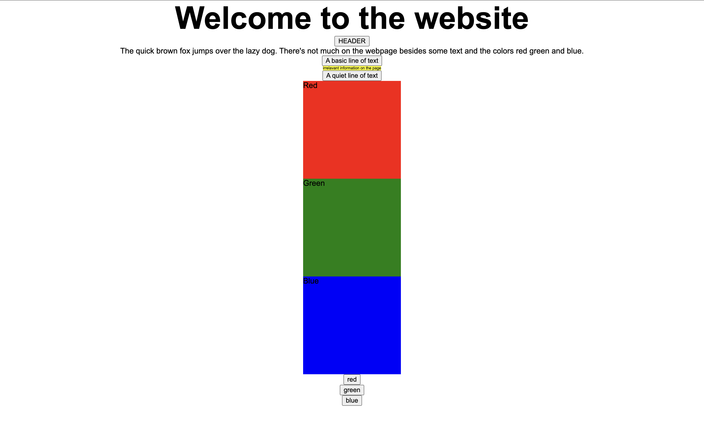
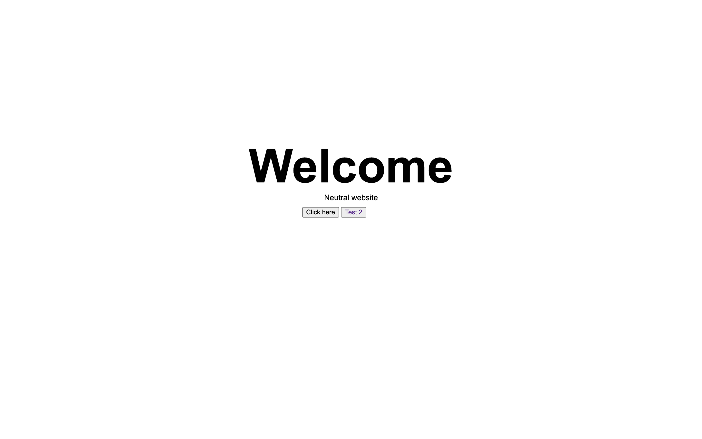
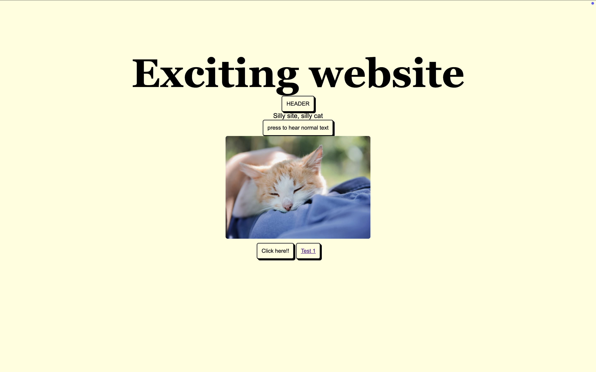

# HCD
Human Centered Design

## Het probleem: Nuances op het web
Een hoop nuances ontgaan Berend. Mensen die kunnen zien krijgen bijvoorbeeld direct een eerste indruk van een website zodra ze de pagina zien. Door kleur, typografie, opmaak, krijgen we direct een idee van wat voor website het is. Vrolijk, vriendelijk, punk, zakelijk, neutraal, grappig...vaak geeft de vormgeving al iets weg. Jouw screen reader daarentegen gebruikt steeds dezelfde stem, die op dezelfde neutrale manier al die verschillende websites voorleest. Het is een stuk lastiger om de sfeer te begrijpen. Geluid zou wellicht kunnen helpen. Kan je vorm en kleur vertalen naar geluid? Zou het misschien mogelijk zijn om intonatie toe te voegen aan een tekst?

## Over Berend
Berend is 29 en ziet ongeveer 3%, hij kon vroeger nog zien maar op zijn 10e werd zijn zicht steeds slechter. Berend ziet in het midden steeds slechter en aan de zijkanten beter. Zijn moeder heeft hetzelfde maar heeft het dan nog erger. Berend ziet vooral roze, groen en geel als hij naar je kijkt dan ziet hij een soort blob vorm. Berend werkt bij een startup die zich bezighoudt met indoor navigatie en hij is ervaringsprofessional bij [Stichting Accessibility](https://www.accessibility.nl/?gad_source=1&gad_campaignid=20220834180&gbraid=0AAAAADP8R64d3G8e6LeRgA0Rysk7n0ar-&gclid=CjwKCAjwvqjOBhAGEiwAngeQnfEomd9t7k8-M6oIVCF0VwZHeEAbAxzkHCw7phhkWYOGhsEI4oBACBoCKDsQAvD_BwE).

Hobby's: houdbewerken, ukelele spelen, programmeren. Houdbewerken omdat je veel tactiele input gebruikt.

Berend gebruikt een screen reader om het web te navigeren.
- Gebruikt een inverted scherm overlay
- Zoom om dingen groter te maken en aan te klikken
- Moet selecteren wat hij voorgelezen wilt hebben

Wat ik heb opgemerkt tijdens de feedback momenten is dat Berend je direct aankijkt terwijl je praat. Dit vond ik grappig omdat hij je natuurlijk niet kunt zien maar wel kunt horen. Ik had niet verwacht dat het gesprek zo normaal zou voelen. 

# Week 1
### Dag 1 • kickoff
#### Maandag 30.03.26

Van de 4 keuzes waaruit ik kon kiezen sprak de nuance opdracht me het meeste aan, omdat je als blinde gebruiker niet door hebt wat de vibe/visual feel is van websites. Het leek mij erg interesant om het neutrale van de screen reader meer expressief te maken en meer te laten reageren op web elementen.

##### Eerste ideeën voor de opdacht
Een screen reader maken met meer emotie en expressie zodat je niet alleen dezelfde neutrale stem hoort en een idee kan krijgen van wat er echt op de website staat zonder dat je de site ziet.

##### Ideeën voor wat de VO zou kunnen:
Als de tekst groter is (zoals op een heading/hero) dan wordt wordt de VO luider, als de tekst normaal is dan is de VO normaal en als de tekst heel klein is (zoals bij een deco element) dan wordt de VO veel zachter.

Met de pitch van de VO wil ik aangeven welke kleur wat is. Wat de pitch van elke kleur precies gaat worden weet ik nog niet. Met een beetje desk research kwam ik uit dan een hoge pitch vooral met lichte kleuren (geel) werden geassocieerd en een lage pitch vooral met donkere kleuren (donker blauw) werden geassocieerd.

Misschien wil ik ook nog iets doen met hoe snel/langzaam de VO dingen zegt maar ik heb nog geen idee voor wat. Ik denk dat dit eerder in combinatie met de dingen hierboven wordt gebruikt dan een heel eigen feature.

Onderzoeksvragen voor mijn opdacht: 
- Wat voor toon associëren we met welke kleur en waarom?
- Synesthesie?
- Wat kan je allemaal doen qua VO manipulatie in JS? -> Eigenlijk niet zo veel... je kunt wel je eigen screen reader maken met de SpeechSynthesis API
	- Hoe ga ik de pitch van de VO veranderen met JS? -> Iets met .pitch van SpeechSynthesis of een andere tool

##### Vragen voor het eerste test moment
- Wat mis jij te vaak qua emotie als je een VO gebruikt?
- Wat associëer jij eerder met kleur? Pitch of snelheid, zijn beide belangrijk of associëer je kleur met een ander geluid?
- Wat bedoel je precies met nuances op het web?
	- Bedoel je dan letterlijk de kleur van de dingen die je kunt zien?
	- Of bedoel je de overal vibe van de website?

<b>Wat heb ik vandaag gedaan?</b>
Brainstormen/ideation voor dit project en wat tools bekeken om te kijken of mijn eerste idee ook echt kan worden uitgebouwd tot een echte web app.

<b>Hoeveel tijd heeft me dat gekost?</b>
9:30 - 16:00

<b>Wat heb ik geleerd?</b>
Hoe je met de Voice Over tool werkt op een site.

<b>Wat ga ik morgen doen?</b>
Testen en erachter komen wat Berend echt nodig heeft. Ik hoop dat ik een antwoord kan krijgen op mijn vragen.

### Dag 2 • Test 1
#### Dinsdag 31.03.26

Site de eerste week:


##### Feedback van Berend ronde 1
- Wat chiller zou zijn is dat de website meteen zegt wat het is i.p.v. de titel van de pagia uitleest
- Alt tekst voor de button/naam van de button
- Hou de range van hard naar zacht redelijk klein -> nu wordt de kleine tekst te zacht voorgelezen

Wat associëer jij eerder met kleur? Eigenlijk een beetje een saai antwoord, het is meer iets wat je omgeving erover verteld bijvoorbeeld: vuur is rood en warm. Kleur is eerder een sociaal concept dan een emotie. Ik zou lichtere kleuren met hogere stemmen associëren maar ik heb er verder niet echt een mooi voorbeeld voor.

Kleuren zijn eigenlijk niet zo boeiend maar de manier waarop ze worden uitgelezen/de vibe wel. Vooral rondvragen en testen wat andere mensen vinden. Vooral groen klinkt als groen.

###### Inzichten
De feedback heeft me inzicht gegeven over hoe Berend visuals ervaart. Wat hij nodig heeft is niet per se meer informatie over kleuren en welke lettertypes er op de site staan. Hoe Berend het zelf heeft uitgelegd: "Eigenlijk is het visuele net als het uitleggen aan een blind persoon wat glans is. Dat is super moeilijk omdat je glans ooit moet hebben gezien om te begrijpen wat het is. Als blind persoon kan je weten wat het is zodat anderen je kunnen begrijpen maar is het voor jezelf eigenlijk nutteloos. Net zoals hoe de lucht blauw is en je weet dat de lucht blauw is maar je het nooit hebt gezien. Als iemand erover vraagt en je dan niet zegt dat de lucht blauw is dan wordt je als dom gezien en wordt je behandeld als 4-jarige." Het grootste inzicht vanuit dit gesprek is dat het visuele concept vooral sociaal is en eigenlijk niet zoveel boeit als je ze toch niet kunt zien.

<b>Wat heb ik vandaag gedaan?</b>
Stemmen aan verschillende onderdelen van de site toegepast en de eerste test met Berend gedaan.

<b>Hoeveel tijd heeft me dat gekost?</b>
Ongeveer 6 uur

<b>Wat heb ik geleerd?</b>
Vooral meer over hoe Berend visuals begrijpt

https://eeejay.github.io/webspeechdemos/

### Voortgang week 1
<details>
<summary> Donderdag 02.04.26 </summary>
Wat we hebben besproken:

- Commando ```say hello``` in de terminal
- Doe vooral veel kleine testen en kom er op die mannier achter wat Berend echt nodig heeft/wat hij vind van bepaalde dingen
- Neutrale site vs sannes website
- [Speech Synthesis Markup Language (SSML)](https://docs.cloud.google.com/text-to-speech/docs/ssml)

Ga vooral veel testen maken zodat je er op die manier achter
</details>

# Week 2
### Dag 3 • Test 2



#### Dinsdag 07.04.26
Ideeën voor de screen reader 
Neutrale site - website wordt gewoon normaal uitgelezen, gewoon default
Leuke site - andere stem gebruiken, meer geluid voor bepaalde interacties

Test resultaten
Interpuncties zoals 's'-toets zijn nice voor programmeren maar niet voor een screen reader.

- Grote tekst is beter -> maak de text zo groot mogelijk
- Prettiger als de buttons ook groter zijn
- Het liefste als je op een afbeelding klikt dat je dan ook het geluid hoort i.p.v een button die je moet klikken
- Hoe maak ik dat kleur voor een blind persoon ook een bepaalde vibe meegeeft. Er is een boek gemaakt over geinterviewde blinden die gevraagd werden wat hun associatie is met geluid. Bijvoorbeeld dat water een golvend textuur heeft.
- Het liefste heb je wel een geluid dat je van de website naar een andere pagina gaat. Niet storend maar wel dat je het opmerkt.
- Maak alles darkmode + highcontrast
- Let op plaatjes want die worden inverted met de overlay
- De font zelf boeit eigenlijk niet zo heel veel, zo lang het niet iets cursief is is het goed

<b>Wat heb ik vandaag gedaan?</b>
Twee testen opgezet, de 2e test gedaan en de wg. Meer informatie gekregen over wat Berend precies zoekt en wat ik kan doen voor de volgende iteratie voor de site.

<b>Hoeveel tijd heeft me dat gekost?</b>
Halve dag

<b>Wat heb ik geleerd?</b>
Meer inzichten gekregen, vooral grotere tekst gebruiken voor de website

### Voortgang week 2
<details>
<summary> Vrijdag 10.04.26 </summary>
Wat we hebben besproken:
- Maak meer prototypes met ssml 
- say command -> say -f a.ssml
</details>

# Week 3
### Dag 4
#### Maandag 13.04.26
<b>Wat heb ik vandaag gedaan?</b>

<b>Hoeveel tijd heeft me dat gekost?</b>

<b>Wat heb ik geleerd?</b>

<b>Wat ga ik morgen doen?</b>

### Dag 5 • Test 3
#### Dinsdag 14.04.26
<b>Wat heb ik vandaag gedaan?</b>

<b>Hoeveel tijd heeft me dat gekost?</b>

<b>Wat heb ik geleerd?</b>

<b>Wat ga ik morgen doen?</b>

### Voortgang week 3
<details>
<summary> Vrijdag 17.04.26 </summary>
Wat we hebben besproken:
</details>

# Week 4
### Dag 6
#### Maandag 20.04.26
<b>Wat heb ik vandaag gedaan?</b>

<b>Hoeveel tijd heeft me dat gekost?</b>

<b>Wat heb ik geleerd?</b>

<b>Wat ga ik morgen doen?</b>

### Dag 7 • Test 4
#### Dinsdag 21.04.26
<b>Wat heb ik vandaag gedaan?</b>

<b>Hoeveel tijd heeft me dat gekost?</b>

<b>Wat heb ik geleerd?</b>

<b>Wat ga ik morgen doen?</b>

### Voortgang week 4
<details>
<summary> Vrijdag 24.04.26 </summary>
Wat we hebben besproken:
</details>

# bronnen
[Pitch](https://stackoverflow.com/questions/53876757/how-to-change-audio-pitch-with-javascript)
[css speech](https://www.w3.org/TR/css-speech-1/)
[aural style sheets deprecated](https://www.w3.org/TR/CSS2/aural.html)
[media speech also deprecated](https://drafts.csswg.org/css2/#valdef-media-speech)
[SpeechSynthesis](https://developer.mozilla.org/en-US/docs/Web/API/SpeechSynthesis)
